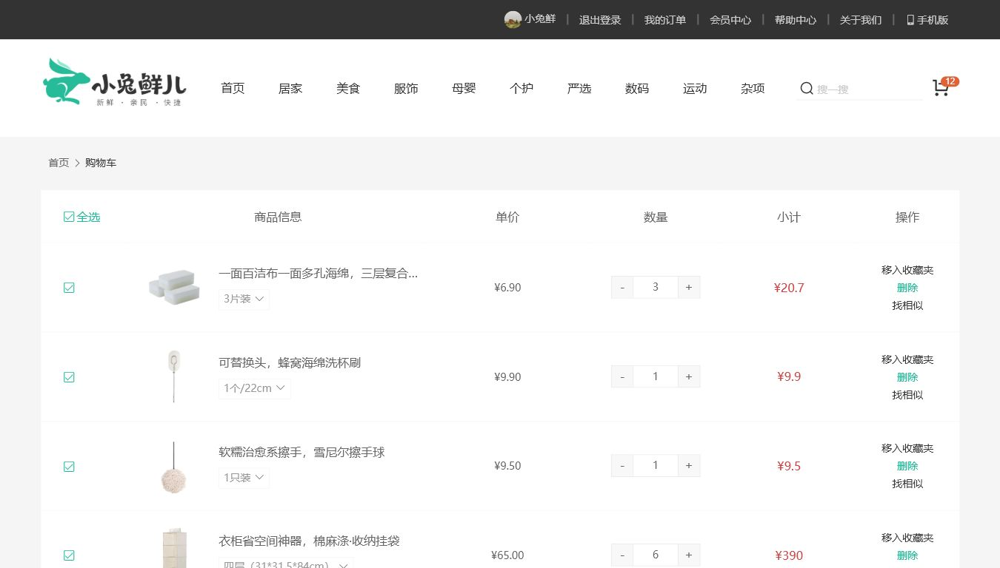

# 小兔鲜儿 B2C 电商平台

小兔鲜儿 B2C 电商平台是一个面向 PC 端的电商演示项目，包含后端工程、本地 Mock Service 和 Vue 3 前端商城。项目覆盖首页、分类、商品、购物车、结算、订单、地址和会员中心等常见电商业务流程。

## 项目组成

```
.
├── backend/                         # 后端工程
│   ├── xtx-mock-service/             # 本地 Mock Service，默认用于前端联调和演示
│   ├── xtx-api/                      # 服务间 API 契约模块
│   │   ├── xtx-api-auth/             # 认证接口契约
│   │   ├── xtx-api-cart/             # 购物车接口契约
│   │   ├── xtx-api-category/         # 分类接口契约
│   │   ├── xtx-api-goods/            # 商品接口契约
│   │   ├── xtx-api-home/             # 首页接口契约
│   │   ├── xtx-api-inventory/        # 库存接口契约
│   │   ├── xtx-api-member/           # 会员接口契约
│   │   ├── xtx-api-order/            # 订单接口契约
│   │   └── xtx-api-payment/          # 支付接口契约
│   ├── xtx-common/                   # 公共能力模块
│   │   ├── xtx-common-core/          # 通用工具、常量、异常等
│   │   ├── xtx-common-web/           # Web 通用封装
│   │   ├── xtx-common-security/      # 安全与认证公共能力
│   │   ├── xtx-common-mybatis-flex/  # MyBatis-Flex 公共配置
│   │   └── xtx-common-openapi/       # OpenAPI 文档相关配置
│   ├── xtx-gateway/                  # 网关服务
│   ├── xtx-services/                 # 业务微服务模块
│   │   ├── xtx-auth-service/         # 认证服务
│   │   ├── xtx-cart-service/         # 购物车服务
│   │   ├── xtx-category-service/     # 分类服务
│   │   ├── xtx-cms-service/          # 内容管理服务
│   │   ├── xtx-comment-service/      # 评论服务
│   │   ├── xtx-goods-service/        # 商品服务
│   │   ├── xtx-home-service/         # 首页服务
│   │   ├── xtx-inventory-service/    # 库存服务
│   │   ├── xtx-logistics-service/    # 物流服务
│   │   ├── xtx-member-service/       # 会员服务
│   │   ├── xtx-order-service/        # 订单服务
│   │   └── xtx-payment-service/      # 支付服务
│   ├── deploy/                       # 本地基础设施配置
│   ├── scripts/                      # 启动与维护脚本
│   ├── sql/                          # 数据库脚本
│   └── pom.xml                       # Maven 父工程
├── frontend/                         # Vue 3 PC 商城前端
│   ├── src/
│   │   ├── api/                      # 接口请求封装
│   │   ├── assets/                   # 静态资源
│   │   ├── components/               # 通用组件
│   │   ├── router/                   # 路由配置
│   │   ├── store/                    # 状态管理
│   │   ├── styles/                   # 全局样式
│   │   ├── utils/                    # 前端工具方法
│   │   └── views/                    # 页面模块
│   ├── package.json
│   └── vue.config.js
├── STARTUP.md                        # 本地启动说明
└── SECURITY.md                       # 本地配置说明
```

## 技术栈

### 后端

- Java 17
- Spring Boot 3.2
- Spring Cloud 2023
- Spring Cloud Gateway
- Spring Cloud Alibaba / Nacos
- MyBatis-Flex 1.9
- MySQL 8.0
- Redis
- Druid
- Seata
- Sentinel
- Maven
- OpenAPI / Knife4j
- JWT
- Docker Compose
- JSON 文件数据源 (Mock)

### 前端

- Vue 3
- Vue Router 4
- Vuex 4
- Axios
- Vue CLI 4
- Less
- VeeValidate 4
- dayjs
- @vueuse/core
- Mockjs

## 功能模块

### 商城前台

- 首页商品展示
- 商品分类
- 商品搜索
- 商品详情
- 购物车
- 订单结算
- 订单创建
- 支付模拟
- 订单列表
- 订单详情
- 地址管理
- 会员中心
- 收藏与浏览历史

### 后端能力

- 本地 Mock Service
- 统一响应结构
- 会员数据模拟
- 商品与分类数据模拟
- 购物车数据处理
- 订单数据处理
- 地址数据处理
- 支付状态模拟
- 本地演示数据重置
- 微服务模块预留与扩展

## 项目预览

| 首页 | 分类页 |
|---|---|
|  |  |

| 购物车 |
|---|
|  |

## 本地启动

启动本地接口服务：

```bash
cd backend/xtx-mock-service
mvn spring-boot:run
```

启动前端：

```bash
cd frontend
npm install
npm run serve
```

默认访问地址：

```
http://localhost:8080
```

接口服务默认地址：

```
http://localhost:8099
```

### 测试账号

```
账号：xiaotuxian001
密码：123456
```

## 相关仓库

- Mock Service：`https://github.com/18307519324az/xiaotuxian-mall-mock-service`
- 前端项目：`https://github.com/18307519324az/xiaotuxian-mall-frontend`

## 更多说明

- 本地启动方式见 `STARTUP.md`
- 本地配置方式见 `SECURITY.md`
- Mock Service 说明见 `backend/xtx-mock-service/README.md`
- 前端说明见 `frontend/README.md`

## 说明

本项目定位为 PC 端电商演示项目，建议浏览器宽度不低于 1240px。
