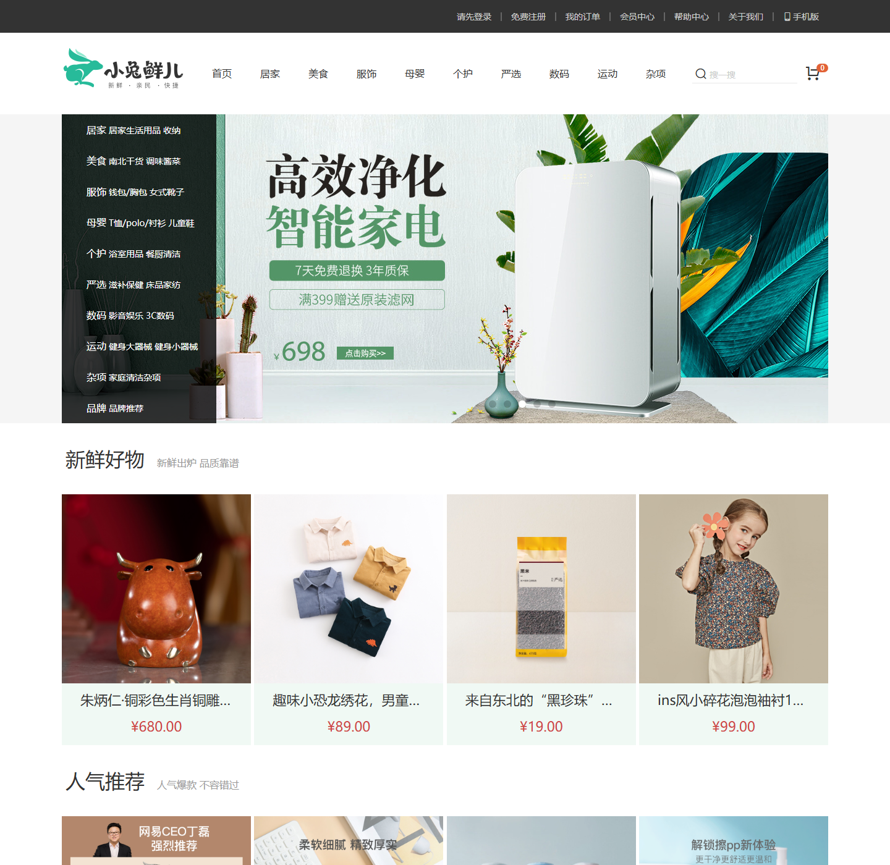

# 小兔鲜儿 B2C 电商平台

## 项目简介

小兔鲜儿 B2C 电商平台是一个前后端分离的 PC 商城项目，包含 Vue 3 前端、本地 Mock Service 和真实微服务后端。项目覆盖首页、商品分类、商品详情、购物车、结算、订单、支付、地址、会员中心等常见电商流程，并围绕电商核心链路实现了库存防超卖、同步/异步下单、优惠券与礼品卡结算等能力。

项目支持两种运行模式：

1. Mock 聚合模式：前端对接 Spring Boot Mock Service，适合本地页面演示和快速联调。
2. 真实微服务模式：后端接入 MySQL、Redis、RabbitMQ，适合演示库存预扣、异步下单和订单状态流转。

## 项目亮点

- 库存防超卖：通过 Redis Lua 原子预扣库存，结合数据库库存预占模型，避免并发下单导致超卖。
- RabbitMQ 异步下单：异步接口先完成库存预扣，再投递 MQ，由消费者创建订单，前端轮询订单处理状态。
- 同步下单兜底：保留同步下单接口，便于本地演示和对比异步链路。
- 优惠券与礼品卡结算：结算页支持优惠券选择、礼品卡使用、货到付款手续费计算，支付页和订单详情页可回查权益信息。
- 前端库存闭环：分类页、商品详情、购物车和结算页均展示或校验库存状态。
- 并发压测验证：通过同一 SKU 小库存高并发下单，验证 Redis 和数据库库存不出现负数，成功订单数不超过初始可售库存。
- Mock 与真实服务双模式：既支持前端快速联调，也支持真实微服务链路演示。

## 技术栈

### 真实微服务后端

- Java 17
- Spring Boot 3.2.5
- Spring Cloud 2023
- Spring Cloud Alibaba / Nacos
- OpenFeign
- MyBatis-Flex
- Druid
- MySQL 8
- Redis
- RabbitMQ
- Maven
- OpenAPI / Knife4j
- JWT

### PC 商城前端

- Vue 3
- Vue Router
- Vuex
- Axios
- Vue CLI
- Less
- VeeValidate
- dayjs
- @vueuse/core
- Mockjs

### 本地 Mock Service

- Java 17
- Spring Boot 3.2.5
- Spring Web
- Jackson
- Hutool
- Lombok
- JSON 文件数据源

主仓展示的是完整平台能力，因此同时包含真实微服务链路、本地 Mock Service 和前端能力说明；独立 Mock Service 仓库只保留本地接口服务相关技术栈，不包含 MySQL、Redis、RabbitMQ。

## 仓库结构

- `xtx-services`：真实微服务实现，覆盖库存、订单、支付、会员、商品、分类等服务
- `xtx-api`：服务间 API 契约
- `xtx-common`：公共组件、基础配置、安全、OpenAPI 与 MyBatis-Flex 支撑
- `xtx-mock-service`：本地 Mock 聚合服务
- `backend/sql`：数据库初始化与补充脚本
- `docs`：演示、验收、链路说明与面试问答
- `scripts`：本地验证脚本

## 核心功能

- 首页、分类、品牌、专题与商品详情展示
- 商品列表库存排序、仅看有货与 SKU 库存提示
- 购物车数量调整、库存校验与批量结算
- 结算页地址、配送时间、支付方式选择
- 优惠券、礼品卡、货到付款手续费联动计算
- 同步下单、异步下单、支付页、订单详情与会员订单中心
- 地址、收藏、浏览历史、评价、售后等会员侧功能

## 重点实现

### 库存防超卖

下单前通过 Redis Lua 脚本完成库存原子预扣减，库存不足时直接拒绝下单。数据库侧使用 `availableStock / lockedStock / soldStock / totalStock` 状态模型，支付成功时确认扣减，取消订单时释放锁定库存并回补 Redis，保证库存状态可追踪。

### RabbitMQ 异步下单

异步下单接口 `/member/order/async` 在校验订单 token、地址、商品和库存后，将订单创建消息发送到 RabbitMQ。消费者异步创建订单，并将处理结果写入订单处理状态，前端通过 `/member/order/process/{orderNo}` 轮询展示 `PROCESSING / SUCCESS / FAILED`。

### 优惠券与礼品卡

结算页支持优惠券选择、礼品卡使用、货到付款手续费和金额明细实时计算。同步下单与异步下单都会携带 `couponId` 和 `giftCardCode`，后端保存权益快照，支付页和订单详情页可以展示优惠券抵扣、礼品卡抵扣和实付金额。

### 并发压测

项目使用同一 SKU 小库存并发下单进行压测验证。测试中成功订单数不会超过初始可售库存，Redis 库存和数据库库存均不出现负数，满足 `totalStock = availableStock + lockedStock + soldStock` 的守恒关系。

## 项目截图

首页：



分类页与库存排序：


结算页权益抵扣：


## 本地启动

### 环境要求

- JDK 17+
- Maven 3.8+
- Node.js 16+
- MySQL 8
- Redis
- RabbitMQ

### 后端构建

```bash
mvn -q clean package -DskipTests
```

### 前端构建

```bash
npm install
npm run build
```

## 详细文档

- [演示路线](docs/DEMO.md)
- [库存与订单流程说明](docs/STOCK-ORDER-FLOW.md)
- [库存与订单验收清单](docs/STOCK-ORDER-ACCEPTANCE.md)
- [异步下单 E2E 验收报告](docs/ASYNC-ORDER-E2E-QA.md)
- [异步下单库存链路收口报告](docs/ASYNC-ORDER-STOCK-CLOSEOUT.md)
- [结算页优惠券与礼品卡闭环](docs/ORDER-BENEFIT-FLOW.md)
- [面试项目问答](docs/INTERVIEW-PROJECT-QA.md)

## 测试与验收

- 单元测试
- 本地 E2E 验收
- 低库存受控并发压测
- 前端生产构建验证
- 后端聚合打包验证

## 相关仓库

- [xiaotuxian-mall-mock-service](https://github.com/18307519324az/xiaotuxian-mall-mock-service)
- [xiaotuxian-mall-frontend](https://github.com/18307519324az/xiaotuxian-mall-frontend)

## 项目定位

这是一个面向公开展示、简历说明和面试讲解的电商工程样例。它既保留了前端可见的交易体验，也保留了后端库存、订单、支付和异步链路，适合用于展示从页面到微服务的一体化实现。
